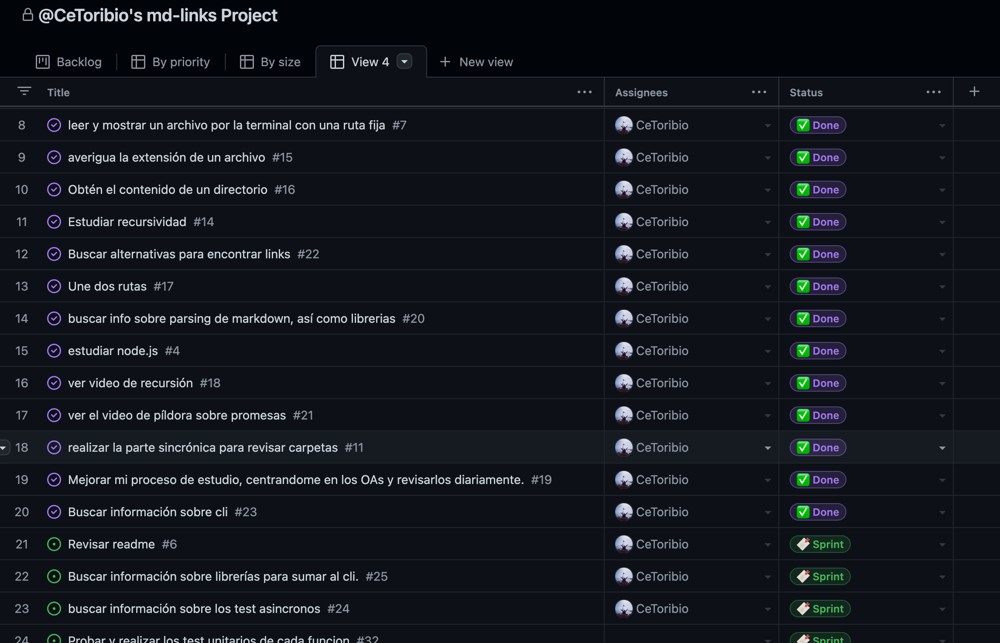
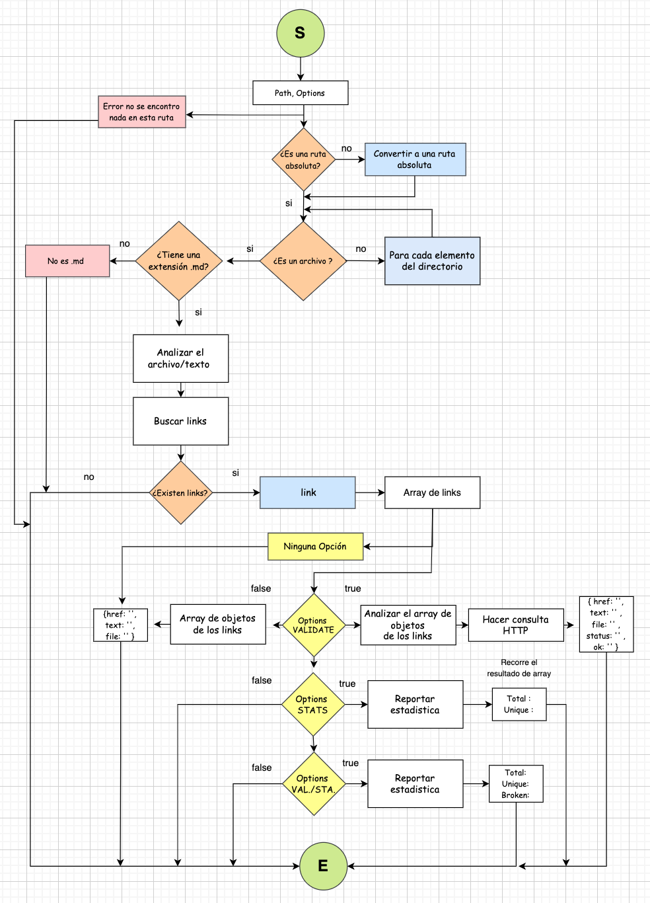

# Markdown Links

## Índice

* [1. Introducción](#1-introducción)
* [2. Objetivo del proyecto](#2-objetivo-del-rpyecto)
* [3. Plan de acción](#3-plan-de-acción)
* [4. Proyecto](#5-proyecto)

***

## 1. Introducción

[Markdown](https://es.wikipedia.org/wiki/Markdown) es un lenguaje de marcado
ligero muy popular entre developers. Es usado en muchísimas plataformas que
manejan texto plano (GitHub, foros, blogs, ...) y es muy común
encontrar varios archivos en ese formato en cualquier tipo de repositorio
(empezando por el tradicional `README.md`).

Estos archivos `Markdown` normalmente contienen _links_ (vínculos/ligas) que
muchas veces están rotos o ya no son válidos y eso perjudica mucho el valor de
la información que se quiere compartir.

[Node.js](https://nodejs.org/es/) es un entorno de ejecución para JavaScript
construido con el [motor de JavaScript V8 de Chrome](https://developers.google.com/v8/).
Esto nos va a permitir ejecutar JavaScript en el entorno del sistema operativo,
ya sea tu máquina o un servidor, lo cual nos abre las puertas para poder
interactuar con el sistema en sí, archivos, redes, ...


## 2. Objetivo del proyecto

Crear una herramienta usando Node.js, que lea y analice archivos en formato Markdown, para 
verificar los links que contengan y reportar algunas estadísticas. Dicha herramienta tiene una 
parte modular y una instalable.

## 3. Plan de acción

Para desarrollar esta herramienta: 
 - Se utilizo GitHub project, empleando los Milestone para los objetivos especificos y pasos para 
 construir la libreria, y los Issues para dividirlos en tareas pequeñas.

 

 - Tambien se realizo un Diagrama de Flujo para contruir el camino y planificar antes de codear. Este 
 diagrama fue iterando a lo largo del desarrollo del proyecto, llegando finalmente a la imagen que 
 podemos ver.

 

## 4. Proyecto

### Archivos
    
Este proyecto cuenta con los siguientes archivos:

- data.js: en el que se encuentra las funciones que constituyen la función md-links.
- index.js: este archivo almacena la función md-links, esta regresa una promesa con un array de objetos.
- api.js: contiene el modulo exportable.
- cli.js: contiene la linea de comandos para ser ejecutado por la terminal. 


### API

Contiene la función mdLinks

#### `mdLinks(path, options)`

### Argumentos

* `path`: Ruta absoluta o relativa al archivo.
Si la ruta ingresada es relativa, se resuelve como absoluta.
* `options`: Un objeto con dos propiedades:
  - `validate`: Booleano que determina si se desea validar los links
    encontrados.
  - `stats`: Booleano que determina si se desea obtener un reporte estadístico de los links
    encontrados. (Total:  , Unique:   )
  - Se considerara una tercera opción en caso ambos sean 'true', en la que entrega un reporte estadístico de los links
   encontrados.  (Total:  , Unique:  , Broken:   )


### Valor de retorno

La función retorna una promesa (`Promise`) que resuelve un arreglo de objetos, donde cada objeto representa un link y contiene
las siguientes propiedades

Con `validate:false` :

* `href`: URL encontrada.
* `text`: Texto que aparecía dentro del link (`<a>`).
* `file`: Ruta del archivo donde se encontró el link.

Con `validate:true` :

* `href`: URL encontrada.
* `text`: Texto que aparecía dentro del link (`<a>`).
* `file`: Ruta del archivo donde se encontró el link.
* `status`: Código de respuesta HTTP.
* `ok`: Mensaje `fail` en caso de fallo u `ok` en caso de éxito.

#### Ejemplo (resultados como comentarios)

```js
const mdLinks = require("md-links");

mdLinks("./some/example.md")
  .then(links => {
    // => [{ href, text, file }, ...]
  })
  .catch(console.error);

mdLinks("./some/example.md", { validate: true })
  .then(links => {
    // => [{ href, text, file, status, ok }, ...]
  })
  .catch(console.error);

mdLinks("./some/dir")
  .then(links => {
    // => [{ href, text, file }, ...]
  })
  .catch(console.error);
```

### CLI (Command Line Interface - Interfaz de Línea de Comando)

El ejecutable se puede llevar acabo a traves de la terminal.

`md-links <path-to-file> [options]`

Por ejemplo:

```sh
$ md-links ./some/example.md
./some/example.md http://algo.com/2/3/ Link a algo
./some/example.md https://otra-cosa.net/algun-doc.html algún doc
./some/example.md http://google.com/ Google
```

### Options

#### `--validate`

Si pasamos la opción `--validate`, el módulo hace una petición HTTP para
averiguar si el link funciona o no. Si el link resulta en una redirección a una
URL que responde ok, entonces consideraremos el link como ok.

#### `--stats`

Si pasamos la opción `--stats` el output (salida) será un texto con estadísticas
básicas sobre los links.

```sh
$ md-links ./some/example.md --stats
Total: 3
Unique: 3
```

También podemos combinar `--stats` y `--validate` para obtener estadísticas que
necesiten de los resultados de la validación.

```sh
$ md-links ./some/example.md --stats --validate
Total: 3
Unique: 3
Broken: 1
```
